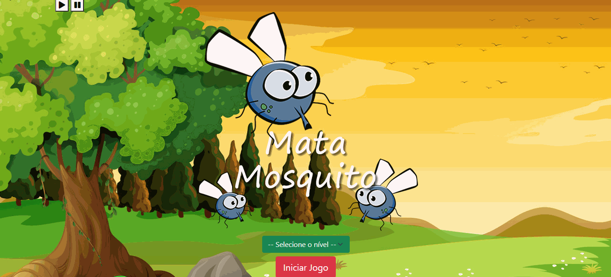

<h1 align="center">
    Game Mata Mosquito 🦟 

</h1>

# 🧐 Sobre

O Game Mata Mosquito é um jogo para dispositivo Desktop, desenvolvido durante o curso Desenvolvimento Web Full Stack da Udemy, com o objetivo de colocar em pratica os conhecimentos adquiridos em Javascript. É um jogo bem legal, em que o usuário pode escolher o nível da partida. Tem até música, é só dar Play (dependendo do seu navegador, ela tocará automaticamente.)

# 💡 Tecnologias Empregadas
No Projeto Game Mata Mosquito, eu utilizei as tecnologias HTML, CSS, Bootstrap e Javascript.

# 🏆 Game em ação - Vitória



# 😥 Game em ação - Derrota


# Acesse o joguinho através do seu dispositivo Desktop clicando neste link:
# https://joguinho-mata-mosquito.netlify.app/


# 📁 Como Baixar o Projeto

```
bash
$ git clone https://github.com/mayaraassef/game_mosquito.git

$ cd game_mosquito

```
## 👀 Dê uma olhada nesses outros projetos
Ei! Não vá ainda! É muito bom te ver por aqui! Dê uma olhada nesses outros projetos que fiz:

- [Sporify Clone](https://github.com/mayaraassef/spotify-clone)
- [Finans](https://github.com/mayaraassef/finans)
- [World](https://github.com/mayaraassef/World-)


